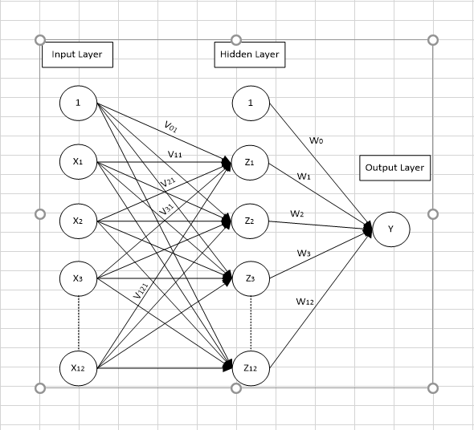

# BPNN + Genetic Algoritm for Import Prediction

Back Propagation Neural Network (BPNN) and Genetic Algoritm (GA) for prediction

## Installation

Use the package manager [pip](https://pip.pypa.io/en/stable/) to install package. Please make sure you use python 3.9.6 or higher

```bash
pip install -r py-requirements.txt
```
or running 
```bash
./install.bat
```
## Usage
for running flask server, please type 
```bash
py index.py
```
in your command or running 
```bash
./serve.bat
```
then, access your IP using port 5000

```
http://127.0.0.1:5000/
```

## API Endpoint
Please using postman and import collection from:
```
https://www.postman.com/collections/131c429487f7007eb718
```

also, you can import collection from json config in:

```
.postman_collection.json
```
## Documentation
You can see what endpoint return in this [Documentaion](https://documenter.getpostman.com/view/1608603/UVsTr2mG)

## Note
Add or edit data only in
```
- data/origin/import.xlsx
```

Warning: dont delete data in this folders
```
- data/origin/*
- data/chromosome/default/*
```

Parameter using in this case is:



## Contributing
Pull requests are welcome. For major changes, please open an issue first to discuss what you would like to change.

Please make sure to update tests as appropriate.

## License
[MIT](https://choosealicense.com/licenses/mit/)
